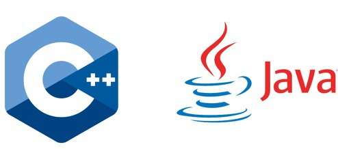

  For one of my computer science classes, ICS 314, I was required to learn JavaScript.  I’ve never had any experience in the language before this class, but I’ve been practicing it over the past two weeks.  All of my JavaScript code so far has been written and run through the site jsfiddle.  Prior to ICS 314 the programming languages that I have experience with are Java, C++, and C.  I still haven’t had too much exposure to JavaScript but I’ve made a few interesting observations based off of my limited experience with all four languages.

  I have observed both similarities and differences between JavaScript and the languages I am already familiar with.  There are similarities between all of the languages.  They share many of the same keywords and the syntax can be fairly similar between them all.  The first significant difference that I notice was that there was no visible main function in JavaScript.  Another difference that I instantly noticed was that variables did not need to be declared with their datatype.  The glaring difference between C and JavaScript is that you can't create objects or classes in C. Lastly, a difference that I noticed between JavaScript and both C++ and Java was that objects could be created in JavaScript without a class. 

  From my first impressions I get the feeling that JavaScript is a safer language then C++, C, and Java.  I say this mainly because I haven’t run into any runtime errors yet.  The arrays are always dynamic and I believe that the memory addresses of variables are inaccessible.  Overall my experience with JavaScript so far has been smooth.  I feel like it’s still too early for me to determine whether the language is good or not because I still don’t have enough knowledge and experience with JavaScript to fully understand its strengths and limitations.
