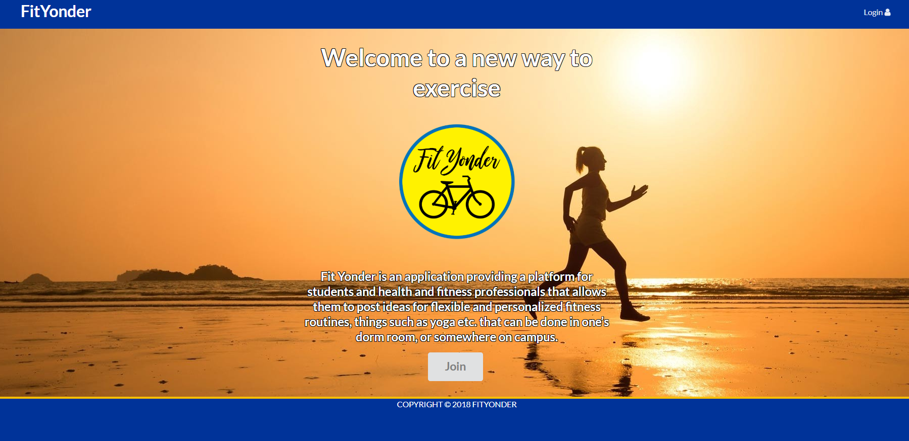

  FitYonder was my final project for software engineering class.  It is a site centered around fitness.  Users are able to share their workout routines or browse workouts shared by other users.  Users can also promote or browse fitness related events. This was a group project between myself,   <a href="https://rknakata.github.io/">Ryan Nakata</a>, and   <a href="">Ivan Iomeli</a>.
  <a href="http://fityonder.meteorapp.com/#/">click here</a>

