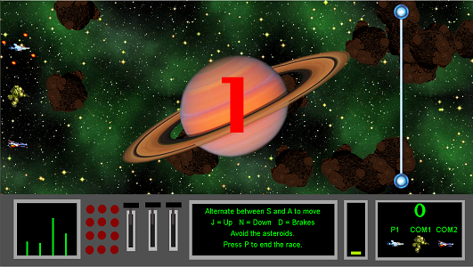

This was the my first Java project and my first project using a graphics library.  It is a racing game that I made for my ICS 111 class.  The player contols a space ship and races against two computer players by alternatingly pressing two buttons.  The racers must avoid asteroids that spawn near the finish line and move against them.  The computer players are programmed to evade the asteroids to a certain extent.  If a racer is hit then they are sent back to the starting line. 

A video demonstation can be viewed [here.](https://www.youtube.com/watch?v=fJVWXSo21uo)

